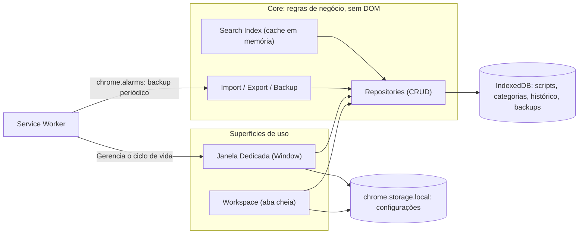
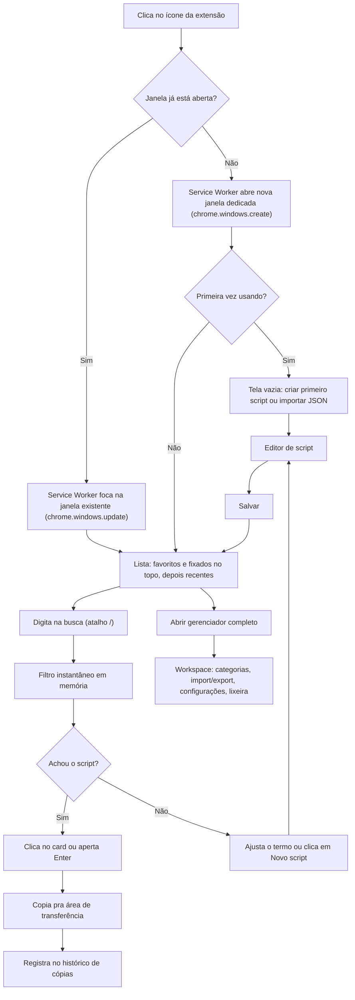

# Documento de Arquitetura — Extensão de Scripts de Atendimento

_Nome de trabalho: **ScriptDesk** (é só um placeholder — troque à vontade quando quiser)_

Este documento cobre arquitetura, dados, telas e roadmap do projeto.

## Sumário

0. Visão geral
1. Arquitetura da aplicação
2. Estrutura de pastas
3. Fluxograma da aplicação
4. Banco de dados local
5. Modelagem das informações
6. Componentes da interface
7. Planejamento das telas
8. Funcionalidades por módulo
9. Ordem ideal de desenvolvimento
10. Roadmap de implementação
11. Possíveis melhorias futuras
12. Próximos passos

---

## 0. Visão Geral

**Problema:** dezenas de scripts de atendimento vivendo num bloco de notas — difícil organizar, buscar e manter atualizado.

**Objetivo:** extensão leve para Chrome e Edge (Manifest V3) que funciona como um "segundo cérebro" de scripts: cadastrar, organizar, buscar e copiar em segundos, sem nunca perder dado.

**Fora de escopo nesta fase** (viram sugestões na seção 11, não compromissos do MVP): sincronização em nuvem, multiusuário/compartilhamento em equipe, IA generativa dentro do produto, apps mobile.

---

## 1. Arquitetura da Aplicação

### 1.1 Visão de alto nível

A extensão tem 4 peças, todas dentro do Manifest V3:

| Peça                                             | Papel                                                                                                                                                                                                                                                                        |
| ------------------------------------------------ | ---------------------------------------------------------------------------------------------------------------------------------------------------------------------------------------------------------------------------------------------------------------------------- |
| **Janela Dedicada (Window)**                     | Superfície principal do dia a dia: abrir → buscar → copiar → fechar. Abre em uma janela própria da extensão iniciada pelo navegador (via `chrome.windows.create`), permitindo minimizar, maximizar, redimensionar, alternar com Alt+Tab e mantendo-se aberta ao clicar fora. |
| **Workspace** (página completa, aberta numa aba) | Reaproveita os mesmos componentes da Janela Dedicada, mas com espaço de sobra pra gerenciar categorias, importar/exportar, configurações e lixeira. Acessada por um botão "Abrir gerenciador completo".                                                                      |
| **Service Worker** (background)                  | Não guarda estado de UI. Cuida do ciclo de vida da Janela Dedicada (abrir uma nova ou focar na existente quando o ícone da extensão é clicado), atalhos de teclado globais, backup automático agendado, badge do ícone.                                                      |
| **IndexedDB**                                    | Fonte única de verdade dos dados: scripts, categorias, histórico, backups internos.                                                                                                                                                                                          |



Por que separar assim: Janela Dedicada e Workspace **compartilham 100% do código de negócio** (`core/`) — a única diferença entre eles é o tamanho da tela e quais telas ficam visíveis. Isso evita ter duas implementações da mesma regra.

### 1.2 Decisões técnicas e por quê

| Camada              | Escolha                                                                                                         | Por quê                                                                                                                                                                                                                                        |
| ------------------- | --------------------------------------------------------------------------------------------------------------- | ---------------------------------------------------------------------------------------------------------------------------------------------------------------------------------------------------------------------------------------------- |
| Linguagem           | **TypeScript**                                                                                                  | Tipagem ajuda a manter Clean Code/SOLID conforme o projeto cresce; contratos entre módulos ficam explícitos.                                                                                                                                   |
| Framework de build  | **WXT** (wxt.dev)                                                                                               | Em 2026 é a opção mais recomendada pra extensões novas: convenções por arquivo (inspirado em Nuxt), Vite por baixo, builds pra Chrome e Edge a partir do mesmo código, e não te rota em nenhuma lib de UI — funciona liso com TypeScript puro. |
| Armazenamento       | **IndexedDB** via wrapper **`idb`** (Jake Archibald)                                                            | O `idb` é minúsculo (~1,2 KB), tipado em TypeScript via `DBSchema`, e elimina o boilerplate de callbacks do IndexedDB puro sem esconder a API por baixo.                                                                                       |
| Configurações leves | **`chrome.storage.local`**                                                                                      | Só pra tema, atalhos, frequência de backup — nunca pra os scripts em si.                                                                                                                                                                       |
| UI                  | **TypeScript vanilla** — funções que retornam DOM + um pub-sub simples escrito à mão (sem framework de runtime) | Zero dependência de framework = bundle mínimo e inicialização instantânea. Pro tamanho desta aplicação isso é suficiente e mais fácil de manter.                                                                                               |
| Ícones              | SVGs do conjunto **Lucide**, inline                                                                             | Leve, sem fonte de ícone, combina com a estética Notion/VS Code.                                                                                                                                                                               |
| Testes              | **Vitest**                                                                                                      | Roda no mesmo ecossistema do Vite/WXT; ótimo pra testar a camada de dados e a validação de import/export isoladamente, sem precisar de navegador.                                                                                              |
| Qualidade           | **ESLint + Prettier** desde o dia 1                                                                             | Consistência de código automática, sem depender só de revisão manual.                                                                                                                                                                          |

### 1.3 Requisitos não funcionais

- **Desempenho:** busca responde na hora mesmo com centenas de scripts; renderiza a lista quase instantaneamente.
- **Baixo consumo:** sem framework de UI pesado; sem _polling_ — tudo baseado em eventos (`chrome.storage.onChanged`, alarms).
- **Privacidade:** 100% local nesta fase, nenhuma chamada de rede, nenhum dado sai da máquina.
- **Acessibilidade:** navegação completa por teclado, foco visível, contraste adequado nos dois temas.
- **Segurança contra ação destrutiva:** excluir, ou importar substituindo tudo, sempre pede confirmação explícita.

---

## 2. Estrutura de Pastas

```
scriptdesk/
├── wxt.config.ts
├── package.json
├── tsconfig.json
├── entrypoints/
│   ├── background.ts              # service worker: gerencia ciclo de vida da janela, alarms, commands
│   ├── window/                    # janela própria da extensão (interface principal)
│   │   ├── index.html
│   │   └── main.ts
│   └── app/                       # workspace em aba cheia
│       ├── index.html
│       └── main.ts
├── src/
│   ├── core/                      # regras de negócio — zero import de DOM
│   │   ├── db/
│   │   │   ├── schema.ts          # object stores + migrations
│   │   │   ├── scripts.repository.ts
│   │   │   ├── categories.repository.ts
│   │   │   ├── history.repository.ts
│   │   │   └── backups.repository.ts
│   │   ├── search/
│   │   │   └── search-index.ts    # cache em memória, normalização, filtro
│   │   ├── import-export/
│   │   │   ├── exporter.ts
│   │   │   ├── importer.ts
│   │   │   └── validators.ts
│   │   └── models/
│   │       └── types.ts           # interfaces
│   ├── store/
│   │   └── app-store.ts           # pub-sub simples, estado reativo da UI
│   └── ui/
│       ├── components/            # ScriptCard, SearchBar, Sidebar, Modal, Toast...
│       ├── views/                 # ListView, EditorView, CategoriesView, SettingsView, TrashView
│       ├── theme/
│       │   └── tokens.css         # variáveis de cor/tipografia (claro/escuro)
│       └── icons/                 # svgs Lucide usados
├── public/
│   └── icon/                      # ícones da extensão (16/32/48/128)
└── tests/
    ├── db/
    ├── search/
    └── import-export/
```

---

## 3. Fluxograma da Aplicação

O fluxo principal — o "abrir → buscar → copiar → fechar em segundos":



---

## 4. Banco de Dados Local

### 4.1 Estratégia de persistência e backup

- **unlimitedStorage:** Permissão declarada no manifest para remover restrições de cota do IndexedDB.
- **Backup Automático Interno:** Roda no service worker via `chrome.alarms` e armazena snapshots compactados de forma rotativa (últimas 7 versões) dentro do próprio IndexedDB.
- **Exportação Manual:** Arquivo `.json` gerado sob demanda para que o usuário possa fazer download.

### 4.2 Schema (Object Stores)

Banco: `scriptdesk-db`, versão 1.

| Object Store  | Campos principais                                                                                                                                   | Índices                                                          |
| ------------- | --------------------------------------------------------------------------------------------------------------------------------------------------- | ---------------------------------------------------------------- |
| `scripts`     | `id`, `title`, `categoryId`, `body`, `tags[]`, `colorTag?`, `isFavorite`, `isPinned`, `usageCount`, `notes?`, `createdAt`, `updatedAt`, `deletedAt` | `categoryId`, `isFavorite`, `isPinned`, `updatedAt`, `deletedAt` |
| `categories`  | `id`, `name`, `color`, `order`, `createdAt`                                                                                                         | `order`                                                          |
| `copyHistory` | `id`, `scriptId`, `copiedAt`                                                                                                                        | `copiedAt`                                                       |
| `backups`     | `id`, `createdAt`, `schemaVersion`, `sizeBytes`, `data`                                                                                             | `createdAt`                                                      |
| `settings`    | linha única com configurações da extensão                                                                                                           | —                                                                |

---

## 5. Modelagem das Informações

Definida em TypeScript na camada `core/models/types.ts`:

```typescript
interface Script {
  id: string;
  title: string;
  categoryId: string | null;
  body: string;
  tags: string[];
  colorTag?: string;
  isFavorite: boolean;
  isPinned: boolean;
  usageCount: number;
  notes?: string;
  createdAt: number;
  updatedAt: number;
  deletedAt: number | null;
  history?: { body: string; editedAt: number }[];
}

interface Category {
  id: string;
  name: string;
  color: string;
  order: number;
  createdAt: number;
}

interface CopyHistoryEntry {
  id: string;
  scriptId: string;
  copiedAt: number;
}

interface BackupSnapshot {
  id: string;
  createdAt: number;
  schemaVersion: number;
  sizeBytes: number;
  data: string;
}

interface Settings {
  theme: 'light' | 'dark' | 'system';
  autoBackup: { enabled: boolean; frequencyHours: number };
  shortcuts: Record<string, string>;
  defaultView: 'list' | 'grid';
  schemaVersion: number;
}
```

---

## 6. Componentes da Interface

Componentes Vanilla reativos baseados no Pub-Sub:

- `AppShell`: Layout compartilhado.
- `SearchBar`: Campo de pesquisa com debounce e suporte ao atalho `/`.
- `Sidebar` / `CategoryList`: Listagem de categorias.
- `ScriptList`: Lista virtualizada para eficiência.
- `ScriptCard`: Visualização compacta e botão de cópia rápida.
- `ScriptEditor`: Formulário de criação/edição.
- `ConfirmModal`: Prevenção contra ações destrutivas.
- `ToastNotification`: Alertas de feedback.
- `SettingsPanel`: Configurações do app.
- `TrashView`: Área de restauração e purga.

---

## 7. Planejamento das Telas

- **Janela Dedicada (Window):** Janela compacta (~380×520px) com o fluxo de busca, lista e cópia rápida, e acesso rápido ao editor.
- **Workspace:** Página completa em aba cheia focada em gerenciamento avançado, lixeira e configurações.

---

## 8. Funcionalidades por Módulo

- **Core/DB:** CRUD e migrações.
- **Search:** Indexação em memória, ordenação, normalização linguística.
- **Import/Export:** Geração de JSON e restauração validada.
- **UI/Tema:** Tokens CSS de cores para modos claro e escuro.

---

## 9. Ordem Ideal de Desenvolvimento

- **Fase 0:** Setup inicial (WXT, TS, dependências, ESLint/Prettier, Vitest).
- **Fase 1:** Camada Core e Banco IndexedDB.
- **Fase 2:** CRUD básico (Integração Core + UI temporária).
- **Fase 3:** Sistema de Busca e Filtros.
- **Fase 4:** Organização (Categorias, Tags).
- **Fase 5:** Módulo de Importação / Exportação.
- **Fase 6:** Lixeira (Soft Delete) e confirmações.
- **Fase 7:** Histórico e métricas simples de uso.
- **Fase 8:** Janela Dedicada (Lifecycle no Background Worker) + Workspace visual.
- **Fase 9:** Testes finais e homologação.

---

## 10. Roadmap de Implementação

- **v0.1:** Fases 0–3 (Core, DB, Busca e Cópia).
- **v0.2:** Fases 4–5 (Categorias e Import/Export).
- **v0.3:** Fases 6–7 (Lixeira e Histórico).
- **v1.0:** Fase 8–9 (Interface de Janela Dedicada, Workspace, atalhos e acabamento visual).

---

## 11. Possíveis Melhorias Futuras

- Sincronização em nuvem.
- Placeholders / variáveis dinâmicas nos scripts (ex: `{{nome_cliente}}`).
- Suporte a Markdown leve.
- Modo equipes / compartilhamento de scripts.

---

## 12. Próximos Passos

1. Aprovação deste documento de arquitetura e do plano de governança.
2. Iniciar a Fase 0 (Setup do projeto).
