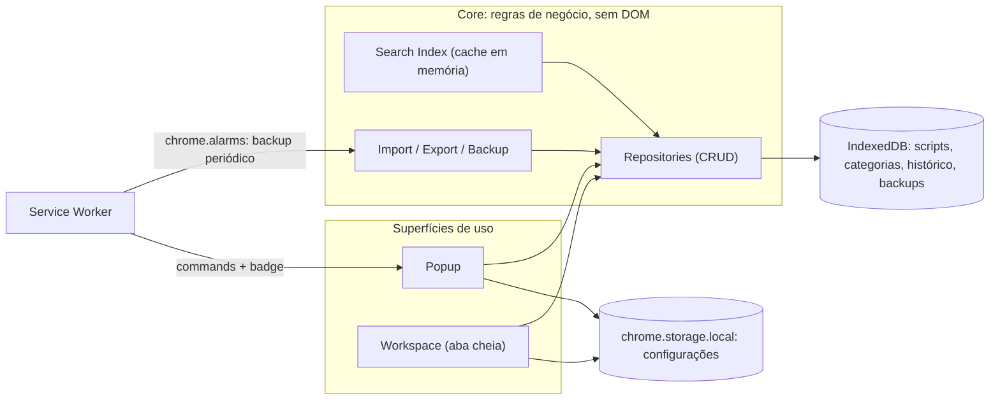
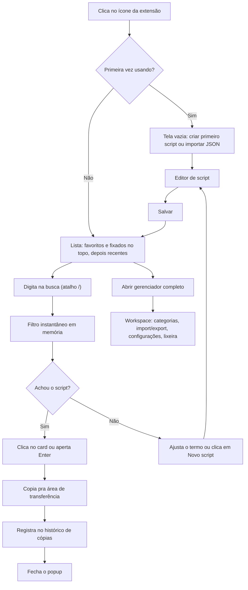

# Documento de Arquitetura — Extensão de Scripts de Atendimento

_Nome de trabalho: **ScriptDesk** (é só um placeholder — troque à vontade quando quiser)_

Este documento cobre arquitetura, dados, telas e roadmap. **Nenhuma linha de código é escrita nesta etapa** — ele existe para você aprovar (ou pedir ajustes) antes de entrarmos na Fase 0 do roadmap.

## Sumário

0. Visão geral
1. Arquitetura da aplicação
2. Estrutura de pastas
3. Fluxograma da aplicação
4. Banco de dados local
5. Modelagem das informações
6. Componentes da interface
7. Planejamento das telas
8. Funcionalidades por módulo
9. Ordem ideal de desenvolvimento
10. Roadmap de implementação
11. Possíveis melhorias futuras
12. Próximos passos

---

## 0. Visão Geral

**Problema:** dezenas de scripts de atendimento vivendo num bloco de notas — difícil organizar, buscar e manter atualizado.

**Objetivo:** extensão leve para Chrome e Edge (Manifest V3) que funciona como um "segundo cérebro" de scripts: cadastrar, organizar, buscar e copiar em segundos, sem nunca perder dado.

**Fora de escopo nesta fase** (viram sugestões na seção 11, não compromissos do MVP): sincronização em nuvem, multiusuário/compartilhamento em equipe, IA generativa dentro do produto, apps mobile.

---

## 1. Arquitetura da Aplicação

### 1.1 Visão de alto nível

A extensão tem 4 peças, todas dentro do Manifest V3:

| Peça                                             | Papel                                                                                                                                                                                         |
| ------------------------------------------------ | --------------------------------------------------------------------------------------------------------------------------------------------------------------------------------------------- |
| **Popup**                                        | Superfície do dia a dia: abrir → buscar → copiar → fechar. Otimizada pra durar poucos segundos na tela.                                                                                       |
| **Workspace** (página completa, aberta numa aba) | Reaproveita os mesmos componentes do popup, mas com espaço de sobra pra gerenciar categorias, importar/exportar, configurações e lixeira. Acessada por um botão "Abrir gerenciador completo". |
| **Service Worker** (background)                  | Não guarda estado de UI. Só cuida do que precisa rodar independente da UI estar aberta: atalho de teclado global, backup automático agendado, badge do ícone.                                 |
| **IndexedDB**                                    | Fonte única de verdade dos dados: scripts, categorias, histórico, backups internos.                                                                                                           |



Por que separar assim: Popup e Workspace **compartilham 100% do código de negócio** (`core/`) — a única diferença entre eles é o tamanho da tela e quais telas ficam visíveis. Isso evita ter duas implementações da mesma regra.

### 1.2 Decisões técnicas e por quê

| Camada              | Escolha                                                                                                         | Por quê                                                                                                                                                                                                                                                                                                                                     |
| ------------------- | --------------------------------------------------------------------------------------------------------------- | ------------------------------------------------------------------------------------------------------------------------------------------------------------------------------------------------------------------------------------------------------------------------------------------------------------------------------------------- |
| Linguagem           | **TypeScript**                                                                                                  | Tipagem ajuda a manter Clean Code/SOLID conforme o projeto cresce; contratos entre módulos ficam explícitos.                                                                                                                                                                                                                                |
| Framework de build  | **WXT** (wxt.dev)                                                                                               | Em 2026 é a opção mais recomendada pra extensões novas: convenções por arquivo (inspirado em Nuxt), Vite por baixo, builds pra Chrome e Edge a partir do mesmo código, e não te trava em nenhuma lib de UI — funciona liso com TypeScript puro. As alternativas mais antigas (CRXJS, Plasmo) vêm mostrando sinais de manutenção mais lenta. |
| Armazenamento       | **IndexedDB** via wrapper **`idb`** (Jake Archibald)                                                            | O `idb` é minúsculo (~1,2 KB), tipado em TypeScript via `DBSchema`, e elimina o boilerplate de callbacks do IndexedDB puro sem esconder a API por baixo.                                                                                                                                                                                    |
| Configurações leves | **`chrome.storage.local`**                                                                                      | Só pra tema, atalhos, frequência de backup — nunca pra os scripts em si. Desde o Chrome 114 o limite padrão é 10 MB, mais que suficiente pra isso.                                                                                                                                                                                          |
| UI                  | **TypeScript vanilla** — funções que retornam DOM + um pub-sub simples escrito à mão (sem framework de runtime) | Zero dependência de framework = bundle mínimo e popup abrindo quase instantaneamente. Pro tamanho desta aplicação (poucas telas, sem SPA complexa) isso é suficiente e mais fácil de manter do que parece. Se um dia quiser mais estrutura, **Lit** (Web Components, ~5 KB) é o upgrade natural sem trocar de arquitetura.                  |
| Ícones              | SVGs do conjunto **Lucide**, inline                                                                             | Leve, sem fonte de ícone, combina com a estética Notion/VS Code que você pediu.                                                                                                                                                                                                                                                             |
| Testes              | **Vitest**                                                                                                      | Roda no mesmo ecossistema do Vite/WXT; ótimo pra testar a camada de dados e a validação de import/export isoladamente, sem precisar de navegador.                                                                                                                                                                                           |
| Qualidade           | **ESLint + Prettier** desde o dia 1                                                                             | Consistência de código automática, sem depender só de revisão manual.                                                                                                                                                                                                                                                                       |

Nenhuma dessas é definitiva — estão aqui pra você aprovar ou pedir ajuste antes da Fase 0 (veja seção 12).

### 1.3 Requisitos não funcionais

- **Desempenho:** busca responde na hora (ver seção 4) mesmo com centenas de scripts; popup renderiza a lista quase instantaneamente.
- **Baixo consumo:** sem framework de UI pesado; sem _polling_ — tudo baseado em eventos (`chrome.storage.onChanged`, alarms).
- **Privacidade:** 100% local nesta fase, nenhuma chamada de rede, nenhum dado sai da máquina — relevante porque scripts de atendimento podem conter informação de cliente.
- **Acessibilidade:** navegação completa por teclado, foco visível, contraste adequado nos dois temas.
- **Segurança contra ação destrutiva:** excluir, ou importar substituindo tudo, sempre pede confirmação explícita (ver seção 4.1).

---

## 2. Estrutura de Pastas

```
scriptdesk/
├── wxt.config.ts
├── package.json
├── tsconfig.json
├── entrypoints/
│   ├── background.ts              # service worker: alarms, commands, badge
│   ├── popup/
│   │   ├── index.html
│   │   └── main.ts
│   └── app/                       # workspace em aba cheia
│       ├── index.html
│       └── main.ts
├── src/
│   ├── core/                      # regras de negócio — zero import de DOM
│   │   ├── db/
│   │   │   ├── schema.ts          # object stores + migrations (seção 4)
│   │   │   ├── scripts.repository.ts
│   │   │   ├── categories.repository.ts
│   │   │   ├── history.repository.ts
│   │   │   └── backups.repository.ts
│   │   ├── search/
│   │   │   └── search-index.ts    # cache em memória, normalização, filtro
│   │   ├── import-export/
│   │   │   ├── exporter.ts
│   │   │   ├── importer.ts
│   │   │   └── validators.ts
│   │   └── models/
│   │       └── types.ts           # interfaces (seção 5)
│   ├── store/
│   │   └── app-store.ts           # pub-sub simples, estado reativo da UI
│   └── ui/
│       ├── components/            # ScriptCard, SearchBar, Sidebar, Modal, Toast...
│       ├── views/                 # ListView, EditorView, CategoriesView, SettingsView, TrashView
│       ├── theme/
│       │   └── tokens.css         # variáveis de cor/tipografia (claro/escuro)
│       └── icons/                 # svgs Lucide usados
├── public/
│   └── icon/                      # ícones da extensão (16/32/48/128)
└── tests/
    ├── db/
    ├── search/
    └── import-export/
```

`core/` não depende de DOM → 100% testável isoladamente. Popup e Workspace só consomem `core/` e `ui/` — nunca duplicam lógica entre si.

---

## 3. Fluxograma da Aplicação

O fluxo principal — o "abrir → buscar → copiar → fechar em segundos" que você descreveu:



---

## 4. Banco de Dados Local

### 4.1 Estratégia de persistência e backup

Este é o requisito que você marcou como muito importante, então vale ser preciso sobre o que o IndexedDB garante de fato:

**O que NÃO apaga os seus dados:**

- Atualização do Chrome/Edge.
- Limpeza do histórico de navegação (é só a lista de sites visitados — não tem relação com o armazenamento da extensão).
- Limpeza de cache ("imagens e arquivos em cache").
- Atualização da própria extensão (nova versão instalada por cima).

**O que PODE apagar os dados** (cenários raros, mas reais):

- Desinstalar a extensão.
- Uma limpeza manual e explícita de "dados de sites e extensões" que inclua a opção IndexedDB — isso existe tanto na tela "Limpar dados de navegação" quanto em extensões de limpeza automática.
- Perder o perfil do navegador inteiro (reinstalar o SO, trocar de perfil sem migrar dados).

É pra cobrir esses cenários raros — e erros humanos, tipo excluir um script sem querer — que existe a estratégia de backup abaixo:

| Mecanismo                       | Como funciona                                                                                                                                                                                                                                                                                                                                        | Aciona quando                            |
| ------------------------------- | ---------------------------------------------------------------------------------------------------------------------------------------------------------------------------------------------------------------------------------------------------------------------------------------------------------------------------------------------------- | ---------------------------------------- |
| **Exportar tudo (JSON)**        | Baixa um arquivo `scriptdesk-backup-AAAA-MM-DD.json` com tudo                                                                                                                                                                                                                                                                                        | Ação manual                              |
| **Exportar CSV** (opcional)     | Gera `.csv` só com os campos tabulares (título, categoria, tags, datas) — não preserva 100% da estrutura, e isso fica avisado na tela                                                                                                                                                                                                                | Ação manual                              |
| **Backup automático periódico** | O service worker roda (via `chrome.alarms`, frequência configurável — padrão diário) e salva um snapshot completo dentro do próprio IndexedDB, num object store separado (`backups`). Mantém as últimas N cópias (padrão 7), descartando as mais antigas. Não gera arquivo nenhum na pasta Downloads — é uma segunda camada de segurança silenciosa. | Automático, em background                |
| **Restaurar com um clique**     | Tela de Configurações lista os backups internos (com data/hora) + opção de importar um `.json` externo. Mostra um resumo ("X scripts serão adicionados, Y substituídos") antes de aplicar, e sempre pede confirmação.                                                                                                                                | Ação manual                              |
| **Validação de importação**     | Todo arquivo (interno ou externo) passa por um validador que confere versão do schema e tipo de cada campo; registros corrompidos são reportados e ignorados em vez de abortar a importação inteira.                                                                                                                                                 | Automático, antes de qualquer importação |

Detalhe técnico: vamos declarar a permissão `unlimitedStorage` no manifest desde o início. Ela remove qualquer teto de quota tanto pro IndexedDB quanto pro `chrome.storage.local`, e não gera nenhum aviso extra de permissão pro usuário — sem motivo pra não pedir.

### 4.2 Schema (Object Stores)

Banco: `scriptdesk-db`, versão 1 (com plano de migração via `upgrade()` do `idb` pra futuras mudanças de schema).

| Object Store  | Campos principais                                                                                                                                                                                         | Índices                                                          |
| ------------- | --------------------------------------------------------------------------------------------------------------------------------------------------------------------------------------------------------- | ---------------------------------------------------------------- |
| `scripts`     | `id`, `title`, `categoryId`, `body`, `tags[]`, `colorTag?`, `isFavorite`, `isPinned`, `usageCount`, `notes?`, `createdAt`, `updatedAt`, `deletedAt` (null = ativo; preenchido = na lixeira), `history?[]` | `categoryId`, `isFavorite`, `isPinned`, `updatedAt`, `deletedAt` |
| `categories`  | `id`, `name`, `color`, `order`, `createdAt`                                                                                                                                                               | `order`                                                          |
| `copyHistory` | `id`, `scriptId`, `copiedAt` — lista limitada (últimas ~100, mais antigas descartadas)                                                                                                                    | `copiedAt`                                                       |
| `backups`     | `id`, `createdAt`, `schemaVersion`, `sizeBytes`, `data` (JSON do export completo) — rotaciona as últimas N                                                                                                | `createdAt`                                                      |
| `settings`    | linha única: tema, atalhos, config. de backup automático, versão do schema                                                                                                                                | —                                                                |

Repare que **não existe object store `trash` separado** — a lixeira é só uma consulta filtrando `scripts` por `deletedAt != null`. Isso evita duplicar dado e mantém uma única fonte de verdade por script.

Sobre a busca: o IndexedDB não faz busca por texto livre nativamente. Pra escala de "dezenas" de scripts (e até uns bons milhares), a solução mais simples e mais rápida na prática é manter um **cache em memória** — um array carregado do IndexedDB quando a UI abre, sincronizado com as escritas — e filtrar com `.filter()` + normalização de acentos (já que o conteúdo é em português). Isso responde em poucos milissegundos sem precisar de índice invertido; só valeria reconsiderar se o volume um dia passar de vários milhares de scripts.

---

## 5. Modelagem das Informações

```typescript
interface Script {
  id: string; // uuid
  title: string; // Assunto
  categoryId: string | null;
  body: string; // Texto completo
  tags: string[];
  colorTag?: string; // token de cor
  isFavorite: boolean;
  isPinned: boolean;
  usageCount: number;
  notes?: string; // Observações
  createdAt: number; // epoch ms
  updatedAt: number;
  deletedAt: number | null; // soft delete / lixeira
  history?: { body: string; editedAt: number }[]; // opcional, tamanho limitado (ex.: últimas 5 versões)
}

interface Category {
  id: string;
  name: string;
  color: string;
  order: number;
  createdAt: number;
}

interface CopyHistoryEntry {
  id: string;
  scriptId: string;
  copiedAt: number;
}

interface BackupSnapshot {
  id: string;
  createdAt: number;
  schemaVersion: number;
  sizeBytes: number;
  data: string; // JSON serializado do export completo
}

interface Settings {
  theme: 'light' | 'dark' | 'system';
  autoBackup: { enabled: boolean; frequencyHours: number };
  shortcuts: Record<string, string>;
  defaultView: 'list' | 'grid';
  schemaVersion: number;
}
```

---

## 6. Componentes da Interface

| Componente                 | Função                                                                                                       |
| -------------------------- | ------------------------------------------------------------------------------------------------------------ |
| `AppShell`                 | Layout base (sidebar + conteúdo), compartilhado por popup e workspace, adaptando a largura                   |
| `SearchBar`                | Campo de busca com _debounce_ (~120ms) e atalho `/`                                                          |
| `Sidebar` / `CategoryList` | Categorias com contagem de scripts                                                                           |
| `ScriptList`               | Lista (virtualizada se >100 itens)                                                                           |
| `ScriptCard`               | Título, prévia do texto, tags, favorito/fixado, botão de copiar rápido                                       |
| `ScriptEditor`             | Textarea com quebra de linha automática e auto-resize, contador de caracteres, seletor de categoria/tags/cor |
| `Toolbar`                  | Novo script, ordenar, alternar tema, abrir workspace                                                         |
| `ConfirmModal`             | Usado antes de excluir, restaurar ou importar substituindo                                                   |
| `ToastNotification`        | Feedback de "copiado!", "salvo", "restaurado"                                                                |
| `SettingsPanel`            | Tema, atalhos, backup automático, import/export                                                              |
| `TrashView`                | Itens excluídos — restaurar ou excluir definitivamente                                                       |
| `EmptyState`               | Quando não há scripts ainda, ou busca sem resultado — sempre com uma ação clara, nunca só um aviso vazio     |

Direção visual: paleta neutra (cinzas quentes) com um único acento de cor pra ações primárias e pra favoritos/fixados — mantendo a estética "quieta" do Notion/Obsidian que você pediu, com um só elemento de destaque por tela em vez de vários competindo entre si. Tipografia: uma fonte de interface legível em tamanho pequeno pros textos de UI (o popup é compacto), e uma fonte monoespaçada só dentro do editor/preview do script — ajuda a visualizar quebras de linha e espaçamento exatos do texto que vai ser colado.

---

## 7. Planejamento das Telas

| Tela                | Onde vive                                     | Conteúdo                                                                                                                 |
| ------------------- | --------------------------------------------- | ------------------------------------------------------------------------------------------------------------------------ |
| **Lista principal** | Popup (~380×520px) e Workspace                | Header (busca + tema) → favoritos/fixados no topo → recentes/mais usados → rodapé com contador de scripts                |
| **Editor**          | Painel lateral ou modal, nas duas superfícies | Assunto, categoria, tags, cor, textarea com contador, observações, ações (salvar/duplicar/excluir)                       |
| **Categorias**      | Só Workspace                                  | Criar/editar/reordenar categorias e cores                                                                                |
| **Configurações**   | Só Workspace                                  | Aparência (tema), atalhos de teclado, backup automático (frequência + últimos backups + restaurar), import/export manual |
| **Lixeira**         | Só Workspace                                  | Excluídos com data, restaurar ou excluir definitivamente                                                                 |
| **Estado vazio**    | Ambas                                         | CTA único: "Criar primeiro script" ou "Importar um JSON existente"                                                       |

---

## 8. Funcionalidades por Módulo

| Módulo        | Funcionalidades                                                                               |
| ------------- | --------------------------------------------------------------------------------------------- |
| Core/DB       | CRUD de scripts e categorias, migrations de schema                                            |
| Search        | Cache em memória, normalização de acentos, ordenação (nome/data/categoria)                    |
| Import/Export | Exportar JSON/CSV, importar com validação, backup automático + restauração                    |
| UI/Tema       | Tokens de cor claro/escuro, componentes compartilhados                                        |
| Atalhos       | Comando global (`commands` API) + atalhos internos de teclado (busca, novo script, navegação) |
| Histórico     | Histórico de cópias e histórico de edições (opcional)                                         |
| Lixeira       | Soft delete, restauração, exclusão definitiva                                                 |

---

## 9. Ordem Ideal de Desenvolvimento

| Fase | Entrega                                                                                         |
| ---- | ----------------------------------------------------------------------------------------------- |
| 0    | Setup: WXT + TypeScript, manifest básico, lint/test configurados, ícones placeholder            |
| 1    | Camada de dados: schema IndexedDB, repositories, migrations + testes unitários                  |
| 2    | CRUD básico ponta a ponta: lista simples + editor simples, sem estilo refinado ainda            |
| 3    | Busca instantânea, ordenação, favoritos, fixar no topo                                          |
| 4    | Categorias e tags, cor/etiqueta                                                                 |
| 5    | Import/Export manual + validação                                                                |
| 6    | Backup automático (alarms) + tela de restauração                                                |
| 7    | Lixeira (soft delete) + confirmação de exclusão                                                 |
| 8    | Histórico de cópias + "mais usados"                                                             |
| 9    | Atalhos de teclado + polish visual (tema, tipografia, animações leves) + Workspace em aba cheia |
| 10   | Testes finais, empacotamento, publicação (Chrome Web Store / Edge Add-ons)                      |

---

## 10. Roadmap de Implementação

| Versão                 | Fases | O que já resolve                                                       |
| ---------------------- | ----- | ---------------------------------------------------------------------- |
| **v0.1** (MVP interno) | 0–3   | O problema principal: cadastrar, buscar, copiar rápido                 |
| **v0.2**               | 4–6   | Organização por categorias + segurança de dados (import/export/backup) |
| **v0.3**               | 7–8   | Lixeira + histórico/uso                                                |
| **v1.0**               | 9–10  | Atalhos, visual finalizado, pronto pra usar no dia a dia com confiança |

Não coloquei prazo em semanas de propósito — depende do seu ritmo. Se quiser, me diga quantas horas você pretende dedicar por semana e eu transformo isso num cronograma.

---

## 11. Possíveis Melhorias Futuras

- Sincronização entre dispositivos (hoje é 100% local).
- Placeholders/variáveis dentro dos scripts (ex.: `{{nome_cliente}}`) com preenchimento rápido antes de copiar.
- Integração com a barra de endereços (omnibox) pra colar direto sem abrir o popup.
- Modo equipe: compartilhamento de scripts entre atendentes (exigiria um backend).
- Estatísticas de uso (scripts mais usados, por categoria) num pequeno painel.
- Exportar pra PDF ou Google Docs.
- Editor com Markdown leve (negrito, listas), mantendo o "simples e agradável" pedido.
- Side Panel do Chrome como alternativa ao popup (fica aberto enquanto você navega) — vale avaliar depois; o suporte a essa API específica ainda varia entre navegadores baseados em Chromium.
- Publicação como produto (Chrome Web Store / Edge Add-ons) com marca própria.

---

## 12. Próximos Passos

Decisões que dependem da sua aprovação antes da Fase 0:

1. Stack: TypeScript vanilla + WXT + `idb` (em vez de React/Vue ou outro build tool).
2. Duas superfícies (Popup + Workspace) em vez de só popup ou só uma página cheia.
3. Lixeira como campo `deletedAt` em vez de um object store separado.
4. Backup automático interno (dentro do IndexedDB) em vez de gerar arquivo na pasta Downloads todo dia.

Quer ajustar alguma dessas antes de eu seguir pra Fase 0, ou já posso preparar a estrutura inicial do projeto?
